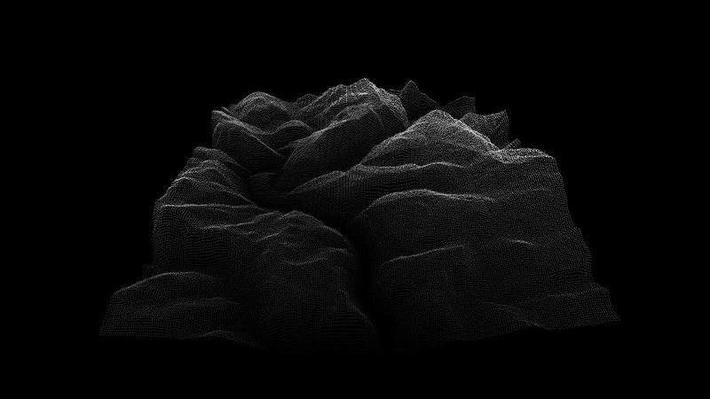
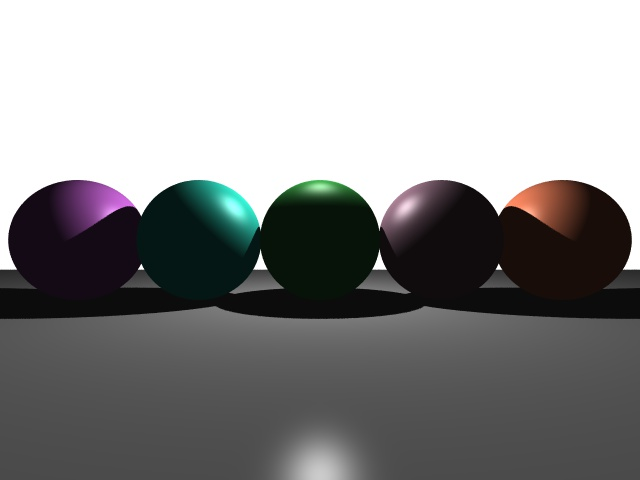

# Graphics Systems Portfolio — OpenGL + C++

This repository contains a collection of graphics programming projects built using C++ and OpenGL. The focus is on low-level rendering systems, procedural geometry, and real-time visual simulation.

Each project was developed as part of academic coursework or extended independently to explore GPU pipelines, shader programming, and systems-level graphics.

---

## Projects

### Height Fields
**Path**: [`height-fields/`](./height-fields/)  
Generates 3D terrain from grayscale images using vertex displacement and color mapping.

- Uses OpenGL and GLSL to perform real-time height-based mesh deformation
- Interactive camera navigation
- Color-coded elevation based on pixel brightness

Preview:  

---

### Roller Coaster Simulation
**Path**: [`roller-coaster-sim/`](./roller-coaster-sim/)  
A real-time simulation of a camera traveling along a spline-based roller coaster track.

- Track geometry generated using Bézier curves
- Camera orientation dynamically aligned with the curve’s tangent and normal
- Visualizes motion through continuous rendering loop
- Formulaic Implementation of Phong lighting from scratch

Preview:  

---

### Raytracer
**Path**: [`raytracer/`](./raytracer/)  
A CPU-based raytracer that simulates light behavior in a virtual 3D scene.

- Implements ray-sphere and ray-plane intersection
- Phong lighting, hard shadows, and basic reflections

Preview:  

---

## Technologies Used

- **Languages**: C++, GLSL
- **Libraries**: OpenGL Core Profile, GLFW, stb_image
- **Core Topics**: Shader programming, Phong lighting, procedural geometry, ray-object intersection, Bézier splines

---

## Build and Run

Each project includes a `README.md` with its own build instructions.  
Most are compiled using g++ or CMake, and depend on:

- OpenGL 3.3+ (Core Profile)
- GLFW
- stb_image.h (for image loading, in height fields)

---

## Purpose

These projects were created to build a deeper understanding of the GPU rendering pipeline, real-time systems, and graphical computation without relying on game engines or high-level abstractions.

---

## License

USC CSCI420. Jernej Barbic.

